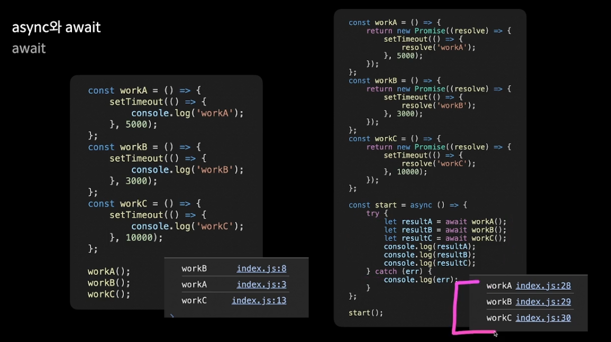

## Chapter1. 비동기 처리

### 비동기란?

- 동기는 하나의 작업이 실행되는 동안은 다른 작업을 수행하지 않는 방식.
- 비동기는 작업이 종료되기 전에 다른 작업을 수행하는 방식.(다른 작업이 끝날때까지 기다리지 않고 수행함.)

### 싱글 스레드와 멀티 스레드

- 스레드는 실행 단위를 의미하며, 한번에 하나의 작업을 수행할 수 있다.
- 자바와 C언어는 멀티 스레딩이 가능한 반면에 자바스크립트는 싱글 스레드를 사용하기 때문에 여러 개의 작업을 동시에 수행할 수 없다.
- 그럼에도 불구하고 자바스크립트의 작업 속도가 빠른 이유는 자바스크립트가 비동기로 작업을 수행하기 때문이다.
- 비동기가 빠른 이유는 3개의 작업을 동기로 수행하게 되면, 하나의 작업이 10초가 걸릴 경우, 30초라는 시간이 필요하지만, 비동기는 10초면 3개의 작업이 끝나게 된다.
- 또한, 텍스트와 이미지가 있는 웹페이지의 경우, 동기로 처리하게 되면, 웹 페이지 로딩 시 이미지 로딩으로 인해 다른 데이터들의 처리도 함께 지연되어 작업이 완료될 때까지 빈 페이지가 노출된다. 클라이언트가 보기에는 오류 화면인지 헷갈릴 수 있다. 이를 방지하려면, 비동기로 이미지와 텍스트 데이터를 처리하여 텍스트 데이터가 먼저 처리된다면 이를 화면에 우선 뿌려주는 식으로 해주면, UX 측면에서도 향상될 수 있다.

### setTimeout

- 비동기 처리를 위한 대표적인 JS 내장 함수이다.
- 매개변수로 콜백함수와 delayTime을 설정할 수 있으며, 이는 딜레이 시간만큼 지연된 후에 콜백함수가 수행 되도록 하는 비동기 처리 내장함수이다.

## Chapter2. 프로미스 객체

- 자바스크립트 내에서 비동기 처리를 더 쉽게 하기 위해서 사용하는 객체.

### 프로미스 객체 생성 및 사용법

- 생성 : 기본적으로 new 키워드와 생성자식을 통해서 생성.

  ```js
  // 실행 함수 - 매개변수 resolve, reject 콜백함수
  // promise 객체 생성과 동시에 executor 실행
  const executor = (resolve, reject) => {
    // 코드
  };

  const promise = new Promise(executor);
  console.log(promise);
  ```

- resolve와 reject

  - 생성된 프로미스 객체는 state와 result 프로퍼티를 갖게 된다.
  - executor 실행 시, state는 pending, result는 undefined로 초기화.
  - 결과에 따라서, executor 성공 시 resolve 함수가 호출되고, state는 fulfilled, result는 성공 결과를 담은 value가 대입된다. 실패 시에는 reject 함수가 호출되고, state는 rejected, result는 실패 결과를 담은 value가 대입된다.

- 비동기 처리를 유용하게 사용하기 위해서는 하나의 비동기 처리에서 처리된 결과값을 가지고 다른 함수에서도 처리하는 방식으로 구현이 된다.
- 하지만, 이는 `콜백 지옥` 이라는 depth가 깊어진 가독성이 떨어지는 복잡한 코드가 발생하게 된다.
  ```js
  workA(10, (resA) => {
    console.log(`workA의 값은 ${resA}`);
    workB(resA, (resB) => {
      console.log(`workB의 값은 ${resB}`);
      workC(resB, (resC) => {
        console.log(`workC의 값은 ${resC}`);
      });
    });
  });
  ```
  - 위 함수는 workA 함수의 결과값을 worB에서 사용하고, workB의 결과값을 workC에서 사용함으로써 콜백지옥에 빠진 결과이다.
  - 비동기 처리의 경우, 특히나 처리 결과의 성공/실패에 따라서 다른 결과를 처리 해야하는 그런 로직들이 주를 이루기 때문에, 콜백지옥에 빠지기 쉽다.
- promise 객체를 사용하는 이유 중 js 비동기 처리 시에 콜백 지옥을 해결하기 위함이다.
- 콜백지옥을 해결하는 Promise 예제

  ```js
  workA(10).then((resA) => {
    console.log(`workA의 값은 ${resA}`);
    workB(resA).then((resB) => {
      console.log(`workB의 값은 ${resB}`);
      workC(resB).then((resC) => {
        console.log(`workC의 값은 ${resC}`);
      });
    });
  });
  ```

  - 위에서 조금 더 가독성이 개선된 코드는 다음과 같다.

  ```js
  workA(10)
    .then((resA) => {
      console.log(`workA : ${resA}`);
      return workB(resA);
    })
    .then((resB) => {
      console.log(`workB : ${resB}`);
      return workC(resB);
    })
    .then((resC) => {
      console.log(`workC : ${resC}`);
    });
  ```

## Chapter3. async와 await

- Promise 객체를 더욱 쉽게 사용할 수 있도록 도와주는 예약어
- async 예약어를 함수 왼쪽에 붙여주면, 이는 promise 객체를 반환하는 함수로 변환된다.
- await 예약어는 async 예약어가 붙은 함수 내에서 사용되며, promise 객체가 처리 완료될 때까지 함수 실행을 동기적으로 기다리도록 만들어 준다.
- 비동기 함수의 실행 함수를 예측이 가능하도록 처리할 수 있다. 즉, 함수 내 실행 순서가 동기적으로 이뤄진다.
- 다시한번 강조하지만, await 예약어는 async를 통해 비동기 처리 함수로 지정된 함수 내에서만 사용이 가능한 예약어 이다.
- 오류 처리를 위해서 try~catch를 사용해줘야 한다.



## Chapter4. API 호출

- 지금까지 배운 비동기 처리는 웹사이트에서 데이터를 주고받는 통신 시에 사용된다.
- API는 클라이언트와 서버 통신 시, 데이터를 주고 받기 위해 약속된 인터페이스.
- 일반적으로 HTTP를 기반으로 통신하는 REST API가 있다.
