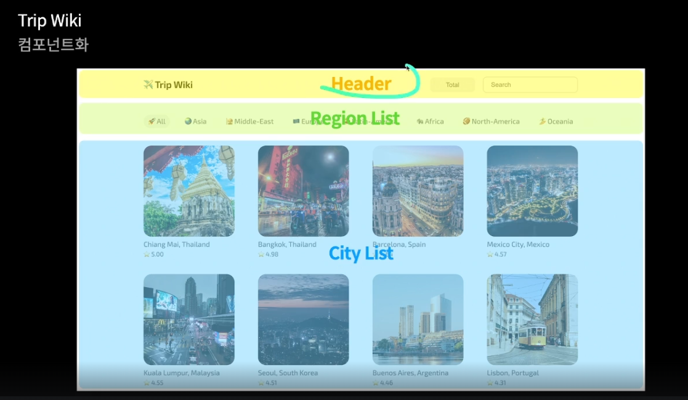

## URL 분석

> https://www.test.com:3000/blog/123?sort=date&search=123#javascript

- https : 프로토콜을 의미함.
  - http : 웹브라우저와 서버 간 데이터 교환
  - https : 보안적으로 상대적으로 안전환 방식
- www.test.com:3000 : 도메인 이름:포트
- /blog/123 : 리소스 경로
- ?sort=date&search=123 : 매개변수(파라미터)
- #javascript : 프레그먼트 식별자, html 요소 id가 해당하는 위치로 이동 가능

## 프로젝트 시작

### 컴포넌트화

- 디자인 페이지를 확인 후 해당 페이지를 어떻게 컴포넌트화 할 지 계획한다.
  
- 위처럼 header 부분, 지역 부분, 도시 부분으로 크게 컴포넌트를 분리할 수 있다.

### 코드 구조화

- 경로 : window.location.pathname
- 경로가 지역인 경우, Header(sort, search), Region List, City List를 렌더링
- 경로가 도시인 경우, Header, City Detail을 렌더링
