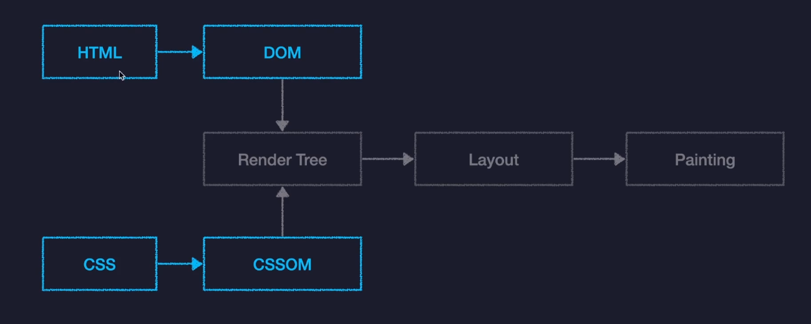

> 출처 : [한입 크기로 잘라먹는 리액트 - 이정환](https://www.inflearn.com/course/%ED%95%9C%EC%9E%85-%EB%A6%AC%EC%95%A1%ED%8A%B8/dashboard)

# React.js 개론

## Chapter01.React.js를 소개

- React.js란?
  - 페이스북(메타)에서 개발한 오픈소스 Javascript 라이브러리
  - 대규모 웹 서비스의 UI를 더 편하게 개발하기 위해 만들어진 기술
- React 기술적 특징
  1. 컴포넌트를 기반으로 UI를 표현한다.
  2. 화면 업데이트 구현이 쉽다.
  - 업데이트 : 사용자의 행동(클릭, 드래그, 드롭, ...)에 따라 웹페이지가 스스로 모습을 바꿔 사용자와 상호작용하는 모든 것.
  - 선언형 프로그래밍 : 과정은 생략하고 목적만 간결히 명시하는 방식. -> 코드가 간결
    - 명령형 프로그래밍 : 목적을 이루가 위한 모든 일련의 과정을 설명하는 방식. -> 코드가 길고 복잡함
  - 이것이 가능한 이유 : State 변수의 값만 바꿔줌으로써, 화면 업데이트가 가능하기 때문이다.
  3. 화면 업데이트가 빠르게 처리된다.

### 브라우저 렌더링 과정(Critical Rendering Path)

- 내용이 복잡해서, 추후 React App 실습까지 마무리 한뒤에 추가로 학습 예정
